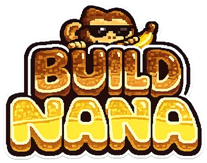

# 🎮 BUILDNANA.js — A JavaScript & TypeScript Game Library

<div align="center">
  
</div>

BUILDNANA is the **fun-first**, 2D game library for **JavaScript** and
**TypeScript**. It’s made to **feel like a game** while you're making games.
Simple. Fast. Powerful.

✨ Whether you’re a beginner or an experienced dev, **BUILDNANA** comes with its
own **web-based editor** — the [JUNGLE](https://play.buildnana.com) — so you can
try code instantly, and learn with more than **90 examples**!

## 🎲 Quick Overview

```js
// Start a game
buildnana({
    background: "#6d80fa",
});

// Load an image
loadSprite("bean", "https://play.buildnana.com/bean.png");

// Add a sprite to the scene
add([
    sprite("bean"), // it renders as a sprite
]);
```

Game objects are composed from simple, powerful components:

```js
// Add a Game Obj to the scene from a list of components
const player = add([
    rect(40, 40), // it renders as a rectangle
    pos(100, 200), // it has a position (coordinates)
    area(), // it has a collider
    body(), // it is a physical body which will respond to physics
    health(8), // it has 8 health points
    // Give it tags for easier group behaviors
    "friendly",
    // Give plain objects fields for associated data
    {
        dir: vec2(-1, 0),
        dead: false,
        speed: 240,
    },
]);
```

Blocky imperative syntax for describing behaviors

```js
// .onCollide() comes from "area" component
player.onCollide("enemy", () => {
    // .hp comes from "health" component
    player.hp--;
});

// check fall death
player.onUpdate(() => {
    if (player.pos.y >= height()) {
        destroy(player);
    }
});

// All objects with tag "enemy" will move to the left
onUpdate("enemy", (enemy) => {
    enemy.move(-400, 0);
});

// move up 100 pixels per second every frame when "w" key is held down
onKeyDown("w", () => {
    player.move(0, 100);
});
```

## 🖥️ Installation

### 🚀 Using `create-buildnana`

The fastest way to get started:

```sh
npx create-buildnana my-game
```

Then open [http://localhost:5173](http://localhost:5173) and edit `src/game.js`.

### 📦 Install with package manager

```sh
npm install buildnana
```

```sh
yarn add buildnana
```

```sh
pnpm add buildnana
```

```sh
bun add buildnana
```

> You will need a bundler like [Vite](https://vitejs.dev/) or
> [ESBuild](https://esbuild.github.io/) to use BUILDNANA in your project. Learn
> how to setup ESbuild
> [here](https://buildnana.com/guides/install/#setup-your-own-nodejs-environment).

### 🌐 Use in Browser

Include via CDN:

```html
<script src="https://unpkg.com/buildnana@3001.0.12/dist/buildnana.js"></script>
```

### 📜 TypeScript Global Types

If you're using **TypeScript**, you used `create-buildnana` or installed with a
package manager and you want **global types**, you can load them using the
following directive:

```ts
import "buildnana/global";

vec2(10, 10); // typed!
```

But it's recommended to use `tsconfig.json` to include the types:

```json
{
  "compilerOptions": {
    "types": ["./node_modules/buildnana/dist/declaration/global.d.ts"]
  }
}
```

> [!WARNING]\
> If you are publishing a game (and not testing/learning) maybe you don't want
> to use globals,
> [see why](https://buildnana.com/guides/optimization/#avoid-global-namespace).

You can also use all **BUILDNANA** source types importing them:

```js
import type { TextCompOpt } from "buildnana"
import type * as BN from "buildnana" // if you prefer a namespace-like import

interface MyTextCompOpt extends BN.TextCompOpt {
  fallback: string;
}
```
